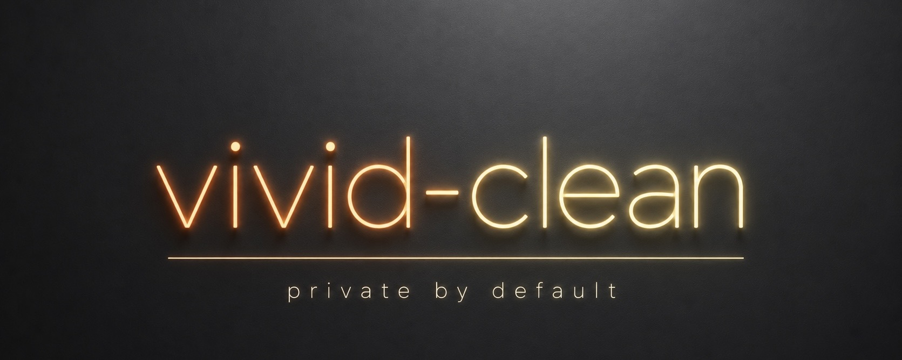

# vivid-clean



[](https://github.com/vnsavitri/vivid-clean/actions/workflows/ci.yml)
[](./LICENSE)
[](./pyproject.toml)
[](#privacy-in-plain-english)

`vivid-clean` removes deterministic provenance marks it can identify, helps you revise AI-assisted writing in your own voice, then checks the exported file for anything left behind.

It exists for people who use AI as an accessibility aid, a writing aid, or part of ordinary work. A marker can't tell the difference between outsourced thinking and help with spelling, structure, fatigue, or a disability.

## What you get

This repo now ships a proper command-line tool as well as an assistant skill:

- A pinned, local metadata-cleaning engine.
- A private working copy for the humanising pass.
- Post-export DOCX scrubbing.
- A verification gate that fails when checks can't finish.
- A readable report beside every finished file.

The report says what was checked, what was removed, what remains, and what wasn't available. It won't call a file universally “clean”, because no honest tool can know what every outside detector will decide.

## Install

vivid-clean supports macOS and Linux. You need Git and Python 3.11 or newer. Pandoc is needed when rebuilding Word, PowerPoint, or PDF-derived documents.

```bash
git clone https://github.com/vnsavitri/vivid-clean.git
cd vivid-clean
chmod +x install.sh
./install.sh
```

The installer creates `.venv` inside the repo, installs the Word, PowerPoint, and PDF document helpers there, and checks out audited dependency commits. It also installs the skill for compatible agents at:

| Assistant | Skill location |
| --- | --- |
| Agent Skills compatible tools | `~/.agents/skills/vivid-clean/` |
| Cursor | `~/.cursor/skills/vivid-clean/` |
| Claude Code | `~/.claude/skills/vivid-clean/` |
| Codex | `~/.codex/skills/vivid-clean/` |

If Node 22 and pnpm are already installed, the installer builds anthropies as a fallback. Missing Node tooling won't break the core installation.

Add `~/.local/bin` to your `PATH` if it isn't there already, then check the setup:

```bash
vivid-clean doctor
```

## Use it with an assistant

Ask your assistant:

> Use the vivid-clean skill on `/full/path/to/Draft.docx`. Keep my meaning and formatting as close as possible, and use a neutral `_reviewed` suffix.

The skill runs two commands around the writing pass:

```bash
vivid-clean prepare "/full/path/to/Draft.docx"
# The assistant revises the session's draft.md.
vivid-clean finish "/private/session/path" --suffix "_reviewed"
```

`prepare` starts the pinned local cleaner with a one-use token, sends the file over loopback, then stops it. You don't need to run a server yourself.

The default suffix is `_vivid` for backwards compatibility. That filename can reveal which tool you used, so choose a neutral suffix when that matters.

You can also compare any two files yourself:

```bash
vivid-clean verify Draft.docx Draft_reviewed.docx
```

Exit status `0` means the applicable checks finished without medium or high residual findings. Status `1` means findings remain. Status `2` means verification couldn't finish.

## What works today

| Input | Current behaviour | Main limitation |
| --- | --- | --- |
| `.docx` | Local metadata cleaning, text extraction, sandboxed rebuild, DOCX property scrub, verification | Markdown round-tripping can flatten complex formatting or omit linked remote images |
| `.pptx` | Local cleaning, text extraction, sandboxed best-effort rebuild, verification | Slide layout, notes, and linked remote images need a close human check |
| `.pdf` | Local cleaning and text extraction, then DOCX output | It doesn't reproduce the original PDF layout |
| `.txt`, `.md` | Local deterministic cleaning, editable text pass, verification | Statistical detectors remain outside the default checks |
| `.png`, `.jpg`, `.jpeg`, `.webp` | Local deterministic cleaning and verification | Pixel-level watermarks need optional upstream backends |

Start with an editable source when you have one. Keep the original, check the result, and pay particular attention to tables, footnotes, slide layouts, legal wording, names, dates, and numbers.

## Privacy in plain English

Metadata cleaning, extraction, rebuilding, and verification run on your computer. The humanising pass happens through whichever assistant you choose. If that assistant is hosted, the text may be sent to its provider under their retention and privacy terms.

Advanced users can point the CLI at a persistent loopback service with `WATERMARKS_SERVICE_URL`. Remote addresses are rejected so a configuration mistake can't upload the file. If the service uses `WATERMARKS_SERVER_API_KEY`, export the same value for the CLI. Don't put the token in a command argument, document, or report. A separately started service's commit can't be independently verified, so its self-reported version is recorded instead of the audited local SHA.

For a fully local workflow, use a locally hosted model such as Ollama to edit the prepared `draft.md`, then run `vivid-clean finish`. A local model can improve privacy, but it doesn't guarantee that a watermark is gone or that a detector will classify the result differently.

## Limits and responsible use

- vivid-clean removes deterministic marks its available checks can find. It can't promise a result against keyed statistical watermarks or private third-party detectors.
- Rewriting can change nuance. You're responsible for checking meaning, attribution, legal intent, and formatting.
- Many schools and workplaces have rules about AI assistance or detector avoidance. Those rules still apply.
- Removing C2PA, EXIF, or copyright-related provenance from somebody else's work may be unlawful and can harm the creator. Only clean files you're entitled to edit.
- A report records test results, not proof of human authorship.

The detailed assumptions and failure cases are in the [threat model](./docs/threat-model.md). Dependency pins and licences are recorded in [DEPENDENCIES.md](./DEPENDENCIES.md).

## Why this exists

AI can make writing possible, or simply less exhausting, for people with dyslexia, ADHD, autism, learning disabilities, injury, fatigue, or a packed day. Treating every assisted sentence as deception erases that difference.

The longer argument is in [AI watermarking is the new scarlet letter](https://www.linkedin.com/pulse/ai-watermarking-new-scarlet-letter-vivid-n-savitri-npzpc).

## Project notes

- Changes are recorded in [CHANGELOG.md](./CHANGELOG.md).
- Security reports belong in the process described in [SECURITY.md](./SECURITY.md).
- Contributions are welcome. Start with [CONTRIBUTING.md](./CONTRIBUTING.md).
- Formatting-preserving document editing is tracked in [ROADMAP.md](./ROADMAP.md).

Built by [Vivid Savitri](https://github.com/vnsavitri) under the [MIT Licence](./LICENSE).
