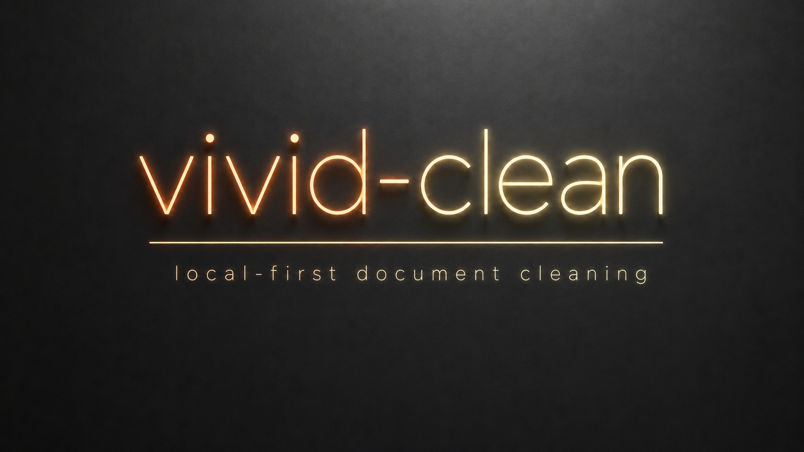
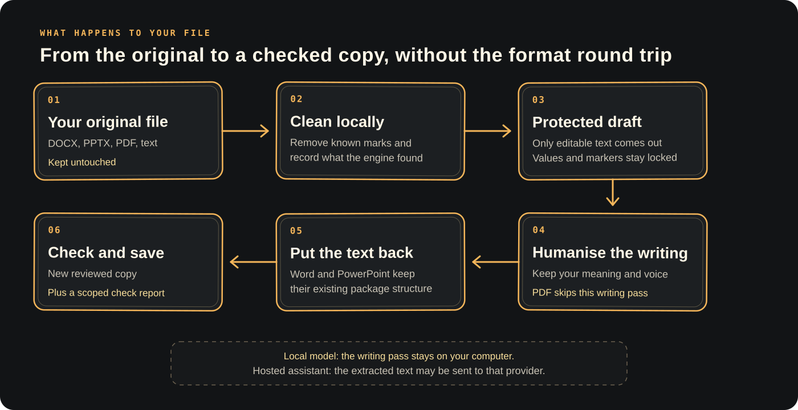

# vivid-clean



[](https://github.com/vnsavitri/vivid-clean/actions/workflows/ci.yml)
[](https://github.com/vnsavitri/vivid-clean/actions/workflows/codeql.yml)
[](https://scorecard.dev/viewer/?uri=github.com/vnsavitri/vivid-clean)
[](https://github.com/vnsavitri/vivid-clean/releases/latest)
[](https://pypi.org/project/vivid-clean/)
[](./LICENSE)
[](./pyproject.toml)
[](#privacy-in-plain-english)

`vivid-clean` is a local-first AI watermark and document metadata cleaner for text, DOCX, PPTX and supported image formats. It removes deterministic provenance marks it can identify, helps you revise AI-assisted writing without flattening your voice, then checks the result and tells you what actually happened. It works by mark type, so it isn't tied to Claude, Codex, Gemini or any other vendor.

I built it for people who use AI as an accessibility aid, a writing aid, or simply part of how they get work done. A marker can't tell the difference between outsourcing your thinking and getting help with spelling, structure, fatigue, or a disability. That distinction matters.

## What you get

You get a command-line tool and an assistant skill. Together, they handle the fiddly bits:

- A pinned, local metadata-cleaning engine.
- A restricted working copy for the humanising pass.
- Format-preserving DOCX and PPTX text editing.
- Post-edit DOCX scrubbing.
- A verification gate that fails when checks can't finish.
- A channel-based report that keeps the cleaning engine's evidence.

The report says what was checked, what came out, what remains, and which checks weren't available. It won't call a file universally “clean”. No honest tool knows what every outside detector will decide.

## Install: pick your route

vivid-clean supports macOS and Linux. It needs Git and Python 3.11 or newer. It doesn't need Pandoc, MarkItDown or Docker.

### New to the command line? Copy this into your AI assistant

Use an assistant that can run terminal commands on your computer, such as Codex, Claude Code or Cursor in agent mode. A browser chat can't install software for you.

Use the copy button in the top-right corner of this box, then paste the whole prompt into your assistant:

```text
Install vivid-clean from the official PyPI package for me. The source repo is https://github.com/vnsavitri/vivid-clean and the package name is vivid-clean.

First check that I'm on macOS or Linux and have Git and Python 3.11 or newer. If pipx is missing, install it using the normal user-level method for my system. Don't use sudo or change system Python without explaining why and asking me first.

Then run:
1. pipx install vivid-clean
2. vivid-clean setup --no-anthropies
3. vivid-clean doctor

If my shell can't find vivid-clean, run pipx ensurepath and tell me whether I need to restart the terminal. Stop and explain any error instead of trying random fixes.

At the end, show me the installed version and which assistant skill folders were updated. Don't clean any documents yet.
```

That gives you the core cleaner without the optional Node-based fallback. Once `doctor` passes, give your assistant a document path using the prompt under [Use it with an assistant](#use-it-with-an-assistant).

### Comfortable in a terminal? Use pipx

Check the prerequisites, then install:

```bash
python3 --version
git --version
pipx --version

pipx install vivid-clean
vivid-clean setup --no-anthropies
vivid-clean doctor
```

`pipx` keeps vivid-clean in its own Python environment. `setup` checks out the reviewed cleaning engine at its exact commit and installs the assistant skill. If your shell can't find the command after installation, run `pipx ensurepath`, restart the terminal and try `vivid-clean doctor` again.

Already installed? Upgrade the package and refresh the pinned cleaner and skill together:

```bash
pipx upgrade vivid-clean
vivid-clean setup --no-anthropies
vivid-clean doctor
```

Leave off `--no-anthropies` if you want vivid-clean to build the optional anthropies fallback when Node 22 and pnpm are available. The core cleaner doesn't need it.

### Installing from source

Use the source route when you want to inspect the code, contribute, or test an unreleased change:

```bash
git clone https://github.com/vnsavitri/vivid-clean.git
cd vivid-clean
chmod +x install.sh
./install.sh
```

The source installer creates `.venv` inside the repo and builds anthropies only when Node 22 and pnpm are already available. Both install routes check out audited dependency commits and put the skill in the folders used by compatible assistants:

| Assistant | Skill location |
| --- | --- |
| Agent Skills-compatible tools | `~/.agents/skills/vivid-clean/` |
| Cursor | `~/.cursor/skills/vivid-clean/` |
| Claude Code | `~/.claude/skills/vivid-clean/` |
| Codex | `~/.codex/skills/vivid-clean/` |

If Codex uses a custom `CODEX_HOME`, the installer uses that location. Existing skill copies are moved out of the assistant's skill folder and backed up under `$XDG_STATE_HOME/vivid-clean/skill-backups/`, or `~/.local/state/vivid-clean/skill-backups/` when `XDG_STATE_HOME` isn't set. That means an old copy can't appear as a duplicate skill. Run `vivid-clean setup --skills-only` when you only want to refresh the assistant instructions. From a source checkout, `./install.sh --skills-only` does the same thing.

## How it works

Your original stays put. vivid-clean makes a restricted working copy, handles the checks it can run locally, and saves the result as a new file with its own report.



For images, “clean” means removing recognised metadata and provenance fields. vivid-clean v0.3.0 doesn't remove visible logos or pixel-level watermarks, and it doesn't send the image to a multimodal model. Those checks stay `not_checked` in the report.

The writing pass follows the assistant you choose. A local model keeps that text on your computer. A hosted assistant may receive the extracted text under that provider's privacy and retention terms.

## Use it with an assistant

Give your assistant the file path and say what you want:

> Use the vivid-clean skill on `/full/path/to/Draft.docx`. Keep my meaning and formatting as close as possible, and use a neutral `_reviewed` suffix.

The skill runs two commands around the writing pass:

```bash
vivid-clean prepare "/full/path/to/Draft.docx"
# The assistant revises the protected text blocks in draft.md.
vivid-clean finish "/private/session/path" --suffix "_reviewed"
```

`prepare` starts the pinned local cleaner with a one-use token, sends the file over loopback, then stops it. You don't need to run a server yourself.

For Word and PowerPoint, `draft.md` is only an editing sidecar. `finish` puts the revised text back into the cleaned OOXML package. It doesn't convert the document to Markdown and rebuild it. Paragraphs, runs, styles, tables, hyperlinks, slide geometry and speaker-note structures stay in place. Numbers, URLs and email addresses are protected, and changed block markers make the run fail.

The default suffix is `_vivid` for backwards compatibility. That filename can reveal which tool you used, so choose a neutral suffix when that matters.

You can also compare any two files yourself:

```bash
vivid-clean verify Draft.docx Draft_reviewed.docx
```

Exit status `0` means the applicable checks finished without medium or high residual findings. Status `1` means findings remain. Status `2` means verification couldn't finish.

The overall report says `checks_passed`, `findings`, or `incomplete`. It also separates deterministic text, file provenance, statistical, proprietary, protected-value and package-structure results. `checks_passed` only covers the checks named in that report.

### About word-choice watermarks

Some newer models can place a keyed statistical pattern in the words they choose. There isn't a hidden character to strip. Light proofreading may leave that pattern alone, and asking the same provider to rewrite the passage can add a fresh mark.

The ordinary `voice-preserving` pass keeps the edit as close to your writing as it can. If you explicitly choose `statistical-risk-reduction`, vivid-clean requires a human or a declared local model with watermarking switched off. It then measures how many original five-word sequences survived and refuses a superficial rewrite when the passage is long enough to measure. That number only describes rewrite depth. It isn't Anthropic's detector, and it can't prove that a keyed mark is gone.

The overlap target shouldn't trump accuracy. Exact quotations, citations, legal language and fixed technical wording may need to stay untouched. When those passages dominate a document, use the voice-preserving mode and treat statistical watermark risk as unresolved.

Anthropic says supported Claude models use a version of SynthID Text and that its official detection API is still forthcoming. Until a detector is actually available and configured, vivid-clean reports the statistical and proprietary channels as `not_checked`. See [Anthropic's technical explanation](https://www.anthropic.com/news/claude-text-watermark) and [marking limitations](https://support.claude.com/en/articles/16266773-how-claude-marks-ai-generated-content).

If you abandon a session, clear expired plaintext working copies with:

```bash
vivid-clean cleanup
# Preview first, or clear every valid session now:
vivid-clean cleanup --dry-run
vivid-clean cleanup --older-than 0
```

## What works today

| Input | Current behaviour | Main limitation |
| --- | --- | --- |
| `.docx` | Local cleaning, package-aware text editing, property scrub, structural check and verification | A close human check is still needed for fields, tracked changes and heavily styled text |
| `.pptx` | Local cleaning, package-aware slide and speaker-note editing, structural check and verification | Rewording can still change line wrapping inside an unchanged text box |
| `.pdf` | Local deterministic cleaning and verification; output stays PDF | Humanising needs the editable source because vivid-clean won't fake a safe PDF reconstruction |
| `.txt`, `.md` | Local deterministic cleaning, editable text pass, verification | Statistical detectors remain outside the default checks |
| `.png`, `.jpg`, `.jpeg`, `.webp` | Local metadata and provenance cleaning, followed by verification; no model required | Pixel-level and visible watermarks aren't removed in v0.3.0 |

Start with an editable source when you have one. Keep the original and check the result. Tables, fields, tracked changes, legal wording and dense slide layouts deserve an extra look.

### Images: what vivid-clean actually cleans

vivid-clean doesn't ask you to choose a model for PNG, JPEG or WebP files. The current image path is deterministic: the pinned cleaner removes metadata and provenance fields it recognises, saves a new image, then verifies that output. The writing pass is skipped.

It doesn't send the image through Kimi, DeepSeek, Qwen or another multimodal model. Those aren't supported pixel-removal backends. A visible logo, an imperceptible pattern baked into the pixels, and other pixel-level marks aren't removed by vivid-clean v0.3.0. The report leaves that check as `not_checked` instead of guessing.

Pixel removal may come later as a separate, opt-in restoration step. It needs an exact backend name, local-versus-hosted disclosure, before-and-after checks, and a warning that generated pixels can change the image. Until that exists and passes real tests, vivid-clean won't claim it.

## Common questions

### Is vivid-clean an AI watermark remover?

It's a scoped one. vivid-clean removes deterministic text marks and document provenance metadata its available cleaners can identify. It also reports which statistical or proprietary checks weren't available. It doesn't promise that every outside detector will agree or that every possible watermark is gone.

### Can it remove Claude, ChatGPT, Codex or Gemini watermarks?

vivid-clean works by mark type rather than vendor name. That means it can clean supported deterministic marks and metadata regardless of which tool produced the file. Keyed statistical text watermarks are different: there may be no hidden character or metadata field to remove. Without an official detector, vivid-clean records those checks as `not_checked` instead of claiming success.

### Does it preserve DOCX and PPTX formatting?

It edits text inside a cleaned copy of the existing Office package. It doesn't convert the file to Markdown and rebuild it. Styles, tables, hyperlinks, slide geometry and speaker-note structures stay in place, but heavily styled files, tracked changes and dense slides still deserve a human check.

### Does it remove visible watermarks from images?

Not currently. For PNG, JPEG and WebP files, vivid-clean removes recognised EXIF, XMP, C2PA and other provenance metadata. It doesn't remove a visible logo or an invisible pattern baked into the pixels. Pixel restoration is tracked as future research in the [roadmap](./ROADMAP.md).

### Does everything run locally?

Cleaning, extraction, package editing and verification run on your computer. The optional writing pass runs wherever your chosen assistant runs. If you use a hosted assistant, that provider may receive the extracted text under its own privacy and retention terms.

### What does `not_checked` mean?

It means vivid-clean didn't have a supported way to run that particular check. It isn't a pass or a hidden failure. The report names the missing check so you can judge the result without guessing.

## Privacy in plain English

Here's the honest version. Metadata cleaning, sidecar extraction, package editing and verification run on your computer. Humanising happens wherever your chosen assistant runs. If it's hosted, your text may go to that provider under its privacy and retention terms.

Advanced users can point the CLI at a persistent loopback service with `WATERMARKS_SERVICE_URL`. Remote addresses are rejected so a configuration mistake can't upload the file. If the service uses `WATERMARKS_SERVER_API_KEY`, export the same value for the CLI. Don't put the token in a command argument, document, or report. A separately started service's commit can't be independently verified, so its self-reported version is recorded instead of the audited local SHA.

Want the whole workflow to stay local? Use a local model such as Ollama to edit the prepared `draft.md`, then run `vivid-clean finish`. That keeps the text on your computer. It still can't guarantee that every watermark is gone or predict what a detector will say.

## Limits and responsible use

- vivid-clean removes deterministic marks its available checks can find. It can't promise a result against keyed statistical watermarks or private third-party detectors.
- A local model is only treated as unwatermarked when the operator declares that watermarking is off. vivid-clean records that claim but can't inspect the sampler that generated the rewrite.
- Rewriting can change nuance. You're responsible for checking meaning, attribution, legal intent, and formatting.
- Many schools and workplaces have rules about AI assistance or detector avoidance. Those rules still apply.
- Removing C2PA, EXIF, or copyright-related provenance from somebody else's work may be unlawful and can harm the creator. Only clean files you're entitled to edit.
- A report records test results, not proof of human authorship.

The detailed assumptions and failure cases are in the [threat model](./docs/threat-model.md). Dependency pins and licences are recorded in [DEPENDENCIES.md](./DEPENDENCIES.md).

## Releases and updates

Meaningful updates get a dated [changelog](./CHANGELOG.md), a matching Git tag, and a [GitHub Release](https://github.com/vnsavitri/vivid-clean/releases). Small copy fixes may sit under `Unreleased` until the next version. If a change affects how your file is handled, installed, or checked, it belongs in the release notes.

The latest release is [v0.3.0](https://github.com/vnsavitri/vivid-clean/releases/tag/v0.3.0). It adds provider-aware statistical watermark guardrails, a tested PyPI package, security scanning, and cleaner setup for packaged installs.

## Why this exists

I built vivid-clean because AI can make writing possible, or simply less exhausting, for people with dyslexia, ADHD, autism, learning disabilities, injury, fatigue, or a packed day. Treating every assisted sentence as deception erases why people use these tools in the first place.

I wrote the longer argument here: [AI watermarking is the new scarlet letter](https://www.linkedin.com/pulse/ai-watermarking-new-scarlet-letter-vivid-n-savitri-npzpc).

## Project notes

- Changes are recorded in [CHANGELOG.md](./CHANGELOG.md).
- Security reports belong in the process described in [SECURITY.md](./SECURITY.md).
- Contributions are welcome. Start with [CONTRIBUTING.md](./CONTRIBUTING.md).
- Work that's still ahead is tracked in [ROADMAP.md](./ROADMAP.md) and on the public [vivid-clean backlog](https://github.com/users/vnsavitri/projects/1).

Built by [Vivid Savitri](https://github.com/vnsavitri) under the [MIT Licence](./LICENSE).
